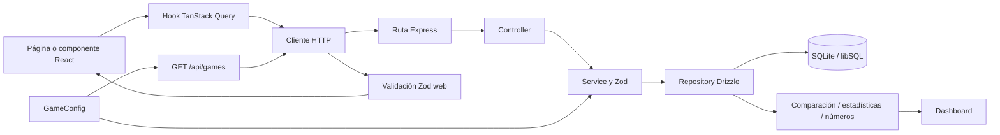

# Arquitectura

> **Propósito:** describir límites, dependencias, flujos y puntos de alto impacto.
> **Cuándo leer:** en cambios transversales, de contratos, datos o estructura.
> **Alcance:** frontend, API y persistencia.
> **Responsable:** mantenimiento técnico.
> **Última revisión:** 2026-07-16.
> **Rutas relacionadas:** [`../apps/web/src`](../apps/web/src), [`../apps/api/src`](../apps/api/src).

## Vista general

## Frontend

El frontend usa una arquitectura por funcionalidades:

- `app/`: composición, providers, router y layouts.
- `features/`: páginas, hooks, schemas y componentes de dominio.
- `components/shared/`: piezas reutilizables de aplicación.
- `components/ui/`: primitivas visuales sin conocimiento de dominio.
- `lib/api/`: única puerta HTTP.
- `store/`: preferencias locales y notificaciones; no datos remotos.

Las páginas pueden reutilizar componentes de otros features, como dashboard e historial. No se detectaron ciclos de imports.

## API

La API agrupa por dominio y usa dos variantes:

- `draws` y `bets`: route → controller → service → repository.
- `games`, `comparison`, `statistics`, `numbers`, `dashboard`: capas ajustadas a su necesidad, reutilizando repositorios y motores puros.

`dashboard` depende de draws, bets, comparison y statistics. `numbers` depende de draws, bets y statistics. Este acoplamiento es intencional, pero convierte esos servicios en puntos de regresión transversal.

## Persistencia

Las tablas son `draws`, `bets` y `bet_lines`. Números y extras se serializan como JSON en columnas de texto. La integridad de su forma vive en Zod y `GameConfig`, no en SQLite. `bet_lines.bet_id` aplica borrado en cascada.

## Entradas y puntos de alto impacto

- Web: `src/main.tsx`, `src/App.tsx`, `src/app/router/AppRouter.tsx`.
- API: `src/server.ts`, `src/app.ts`.
- Reglas: `apps/api/src/config/game-config.ts`.
- Datos: `apps/api/src/db/schema.ts`.
- HTTP web: `apps/web/src/lib/api/client.ts`.
- Caché: `apps/web/src/lib/query/keys.ts`.
- Validación duplicada: schemas de juegos de API y `apps/web/src/lib/validation/game-rules.ts`.

## Archivos generados e ignorados

No editar manualmente `package-lock.json`, `dist/`, migraciones Drizzle generadas ni `migrations/meta`. Ignorar en análisis ordinario `node_modules/`, `apps/api/data/`, `.env`, `.vscode/` y `.claude/settings.local.json`.

No hay autenticación, rate limiting, OpenAPI, CI de despliegue ni observabilidad más allá de Pino/pino-http.
